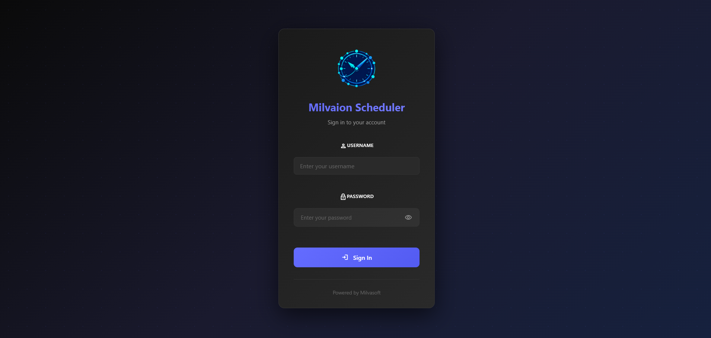
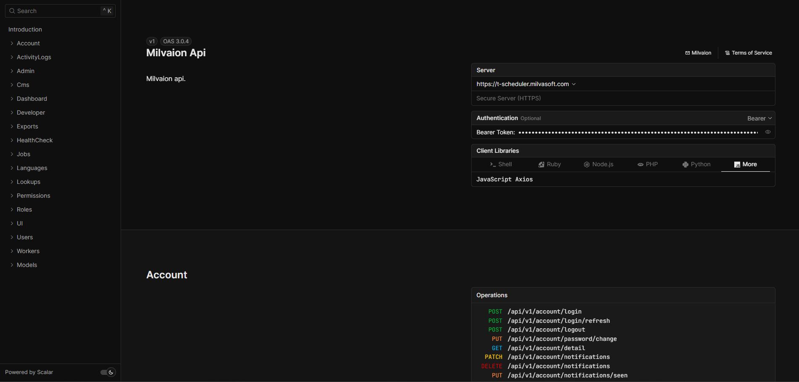
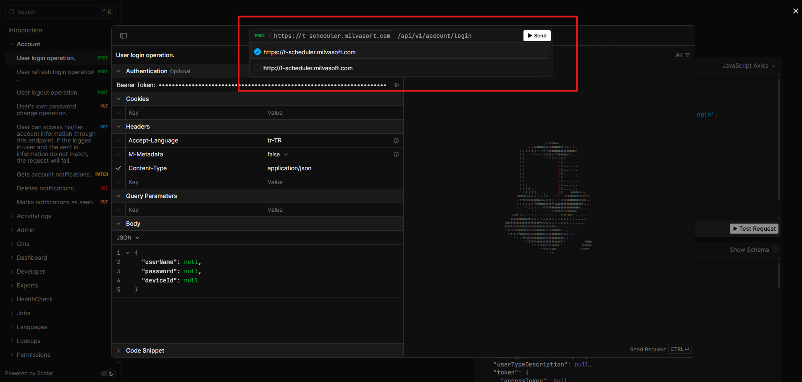

---
id: quick-start
title: Quick Start
sidebar_position: 2
description: Get Milvaion up and running in minutes.
---

# Quick Start

Get Milvaion running locally and execute your first job in **under 10 minutes**.

## Prerequisites

You need:

- **Docker Desktop** (v20.10+) with Docker Compose
- **Web browser** for the dashboard and built-in Open Api Rest Client
- (Optional )**curl** or a REST client (Postman, Insomnia)

Verify Docker is installed:

```bash
docker --version
# Docker version 24.0.0 or higher

docker compose version
# Docker Compose version v2.20.0 or higher
```

## Step 1: Start the Stack

Create a file named `docker-compose.yml`:

```yaml
version: '3.8'

services:
  postgres:
    image: postgres:16-alpine
    container_name: milvaion-postgres
    environment:
      POSTGRES_DB: MilvaionDb
      POSTGRES_USER: postgres
      POSTGRES_PASSWORD: postgres123
    ports:
      - "5432:5432"
    volumes:
      - postgres_data:/var/lib/postgresql/data
    healthcheck:
      test: ["CMD-SHELL", "pg_isready -U postgres"]
      interval: 5s
      timeout: 5s
      retries: 5

  redis:
    image: redis:7-alpine
    container_name: milvaion-redis
    ports:
      - "6379:6379"
    healthcheck:
      test: ["CMD", "redis-cli", "ping"]
      interval: 5s
      timeout: 5s
      retries: 5

  rabbitmq:
    image: rabbitmq:3-management-alpine
    container_name: milvaion-rabbitmq
    environment:
      RABBITMQ_DEFAULT_USER: guest
      RABBITMQ_DEFAULT_PASS: guest
    ports:
      - "5672:5672"
      - "15672:15672"
    healthcheck:
      test: ["CMD", "rabbitmqctl", "status"]
      interval: 10s
      timeout: 5s
      retries: 5

  milvaion-api:
    image: milvasoft/milvaion-api:latest
    container_name: milvaion-api
    ports:
      - "5000:8080"
    environment:
      - ConnectionStrings__DefaultConnectionString=Host=postgres;Port=5432;Database=MilvaionDb;Username=postgres;Password=postgres123
      - MilvaionConfig__Redis__ConnectionString=redis:6379
      - MilvaionConfig__RabbitMQ__Host=rabbitmq
      - MILVAION_ROOT_PASSWORD=admin
      - MILVA_ENV=dev
    depends_on:
      postgres:
        condition: service_healthy
      redis:
        condition: service_healthy
      rabbitmq:
        condition: service_healthy

  test-worker:
    image: milvasoft/milvaion-test-worker:latest
    container_name: milvaion-test-worker
    environment:
      - Worker__WorkerId=sample-worker
      - Worker__RabbitMQ__Host=rabbitmq
      - Worker__Redis__ConnectionString=redis:6379
    depends_on:
      - milvaion-api

volumes:
  postgres_data:
```

Start all services:

```bash
docker compose up -d
```

Wait 30-60 seconds for all services to initialize, then verify:

```bash
docker compose ps
```

You should see all containers running:

```
NAME                  STATUS          PORTS
milvaion-api          Up              0.0.0.0:5000->8080/tcp
milvaion-postgres     Up (healthy)    0.0.0.0:5432->5432/tcp
milvaion-rabbitmq     Up (healthy)    5672/tcp, 0.0.0.0:15672->15672/tcp
milvaion-redis        Up (healthy)    0.0.0.0:6379->6379/tcp
milvaion-test-worker  Up              
```

## Step 2: Access the Dashboard and Rest Client

### Dashboard 

Open your browser: **http://localhost:5000**

You'll see the Milvaion dashboard. 



Default username is `rootuser`. System-wide access is permitted. If you didn't set `MILVAION_ROOT_PASSWORD` in docker-compose, to get the initial user password:

```bash
docker logs milvaion-api 2>&1 | grep -i "password"
```

### Rest Client 

Open your browser: **http://localhost:5000/api/documentation/index.html**

You'll see the Milvaion rest client. A permanent token will be set up for you.


Without proxy, the api will serve only http. For http/https switch on rest client;


## Step 3: Create Your First Job

Use the Dashboard UI, Rest Client or make an API call:

```bash
curl -X POST http://localhost:5000/api/v1/jobs/job \
  -H "Content-Type: application/json" \
  -H "Accept-Language: en-US" \
  -d '{
    "displayName": "My First Job",
    "description": "This is a test job!",
    "tags": "test,first-job",
    "workerId": "sample-worker",
    "selectedJobName": "SampleJob",
    "cronExpression": "* * * * *",
    "executeAt": null,
    "isActive": true,
    "concurrentExecutionPolicy": 0,
    "timeoutMinutes": null,
    "jobData": "{\"message\": \"Hello from Milvaion!\"}"
  }'
```

**What this does:**

| Field | Value | Meaning |
|-------|-------|---------|
| `displayName` | "My First Job" | Human-readable name shown in dashboard |
| `description` | "This is a test job!" | Human-readable description shown in dashboard |
| `tags` | "test,first-job" | Comma seperated tags for job grouping. |
| `workerId` | "sample-worker-01" | Routes to the test worker. This must be exactly the same as your worker configuration. |
| `selectedJobName` | "SampleJob" | Job class name in worker. Must match a job class in the worker |
| `cronExpression` | `* * * * *` | Schedule configuration. Run every minute |
| `executeAt` | "2026-01-15T15:39:00.000Z" | One time job schedule time. Send `null` for the recurring jobs. If both `cronExpression` and `executeAt` sent, `cronExpression` have priority. |
| `concurrentExecutionPolicy` | 0 -> Skip , 1 -> Queue | Scheduling mechanism when concurrent execution happens. |
| `isActive` | `true` | Job is active or not. Deactivated jobs will not create executions. |
| `timeoutMinutes` | `null` | Job timeout in minutes. Default is 10 minute. |
| `jobData` | JSON object | Data passed to the job |

You should receive:

```json
{
    "isSuccess": true,
    "statusCode": 200,
    "messages": [
        {
            "key": "",
            "message": "Operation successful!",
            "type": 1
        }
    ],
    "data": "019bbd29-3321-7a70-9015-489f703db53f",
    "metadatas": []
}
```

The `data` field is your new Job ID.

## Step 4: Watch It Run

### Option A: Dashboard (Recommended)

1. Go to **http://localhost:5000**
2. Login with your credentials.
3. Click **Jobs** in the sidebar
4. Click your job name
5. Wait up to 1 minute for the cron trigger
6. See the **Execution History** populate with occurrences in real-time
7. Click an occurrence to see real-time logs

### Option B: Worker Logs

```bash
docker logs -f milvaion-test-worker
```

Expected output when job runs:

```
info: SampleJob[0]
      🚀 SampleJob started!
info: SampleJob[0]
      Job ID: f47ac10b-58cc-4372-a567-0e02b2c3d479
info: SampleJob[0]
      Received data: {"message":"Hello from Milvaion!"}
info: SampleJob[0]
      ⏳ Processing step 1/5...
info: SampleJob[0]
      ⏳ Processing step 2/5...
...
info: SampleJob[0]
      ✅ SampleJob completed successfully!
```

## Step 5: Trigger Manually (Optional)

Don't want to wait for cron → Trigger immediately via Dashboard or:

```bash
curl -X POST "http://localhost:5000/api/v1/jobs/job/trigger" \
  -H "Content-Type: application/json" \
  -d '{
    "jobId": "YOUR_JOB_ID",
    "reason": "Manual test"
    "force": true
  }'
```

## Verify the System

### API Health

```bash
curl http://localhost:5000/api/v1/healthcheck
```

### List Workers

```bash
curl http://localhost:5000/api/v1/workers
```

### List Job Occurrences(Executions)

```bash
curl "http://localhost:5000/api/v1/jobs/occurrences"
```

### RabbitMQ Management

Open **http://localhost:15672** (guest/guest) to see queues and message flow.

## Cleanup

Stop all services:

```bash
docker compose down
```

Stop and delete all data (fresh start):

```bash
docker compose down -v
```

## Troubleshooting

### "Job not executing"

1. Check worker is running: `docker compose ps`
2. Check worker logs: `docker logs milvaion-test-worker`
3. Verify job is active in dashboard
4. Check RabbitMQ has queues: http://localhost:15672 → Queues

### "API won't start"

1. Check PostgreSQL is healthy: `docker logs milvaion-postgres`
2. Wait for migrations: `docker logs milvaion-api | grep -i migration`
3. Port conflict → Change `5000:8080` to `5001:8080`

### "Worker can't connect"

1. Ensure worker is on same Docker network
2. Use container names (`rabbitmq`, `redis`) in connection strings, not `localhost`
3. Check RabbitMQ is healthy: `docker logs milvaion-rabbitmq`

## What's Next?

Now that Milvaion is running:

1. **[Core Concepts](03-core-concepts.md)** - Understand the architecture
2. **[Your First Worker](04-your-first-worker.md)** - Create a custom worker with your own jobs
3. **[Configuration Reference](05-configuration.md)** - All available settings
